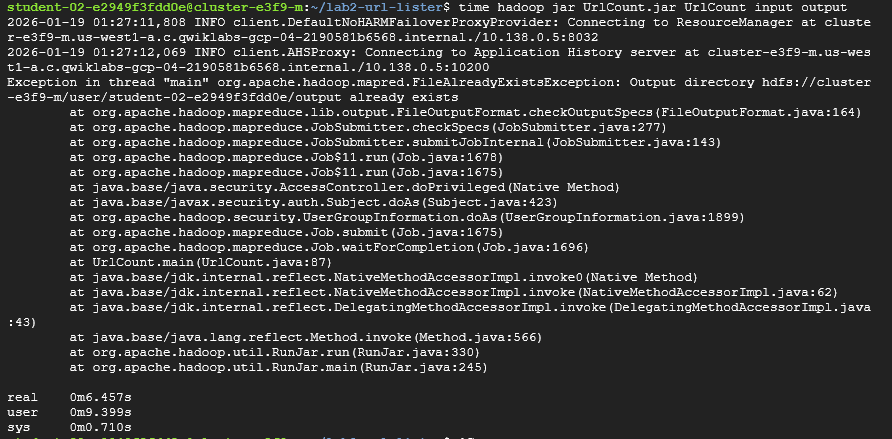
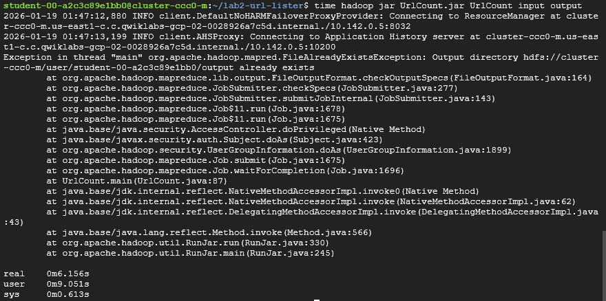

# Solution

My UrlCount solution works similarly to WordCount where the only difference is the tokenization step. In WordCount, words are split by spaces while in UrlCount, each "token" must follow the pattern that is dictated by the regex expression. In other words, UrlCount uses a Pattern Matcher that scans the document from left to right looking for any string that matches href=" and then captures everything up to the closing quotation.

For this assignment, I worked alone and the resources I used were Google Cloud Dataproc, Java, and Hadoop.

The Combiner could cause problems because the applications requires a filter of count > 5 and the Combiner could drop URLs where each node is less than 5, but the total across all nodes is greater than 5. The Combiner would incorrectly exclude those URLs even though their total count is greater than 5. For example, if node A and B both had counts of 3, the Combiner would exclude that url even though the total count aross the cluster is 6.

# 2-node vs 4-node Comparison
2-Node:

4-Node:

We can clearly see that the cluster utilizing 4-nodes has a marginally faster execution time than the 2-node cluster. This is not surprising as the 4-node cluster has more workers that execute in parallel which allows it to process the files quicker.
